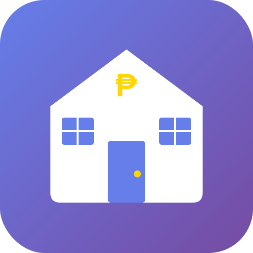

# 🏠 CARENT v2.7.0 - Complete Rental & Business Management System

<p align="center">
  
</p>

<p align="center">
  <strong>All-in-one PWA for rental properties, loans, water refilling stations, and employee payroll.</strong>
</p>

<p align="center">
  <a href="#features">✨ Features</a> •
  <a href="#installation">📥 Installation</a> •
  <a href="#usage">📖 Usage</a> •
  <a href="#play-store">📱 Play Store</a>
</p>

---

## 📱 About CARENT

**CARENT** (Credit And RENTal) is a Progressive Web App (PWA) designed for Filipino small business owners to manage:

- 🏠 **Rental Properties** - Tenants, payments, deposits, late fees
- 💰 **Credits/Loans** - Money lending with interest calculations
- 💧 **Water Refilling** - Customers, sales, credit tracking
- 👷 **Employee Payroll** - Daily attendance, OT, advances, salary
- 📊 **Financial Overview** - Income, expenses, profit tracking

---

## ✨ Features

### 🏠 Property & Tenant Management
- Unlimited properties (apartments, rooms, houses, commercial)
- Complete tenant profiles with photos
- Automatic rent due date tracking
- Late fee calculations
- Payment history & receipts
- Deposit management

### 💰 Credit/Loan Management
- Track money lent to borrowers
- Simple and compound interest support
- Payment tracking with running balance
- Overdue notifications

### 💧 Water Refilling Station
- Customer database
- Sales recording (cash/credit/partial)
- Automatic credit balance tracking
- FIFO payment application

### 👷 Employee Management & Payroll
- **Daily Time Record** - Quick buttons (✅ Present, ❌ Absent, 🕐 Half Day, 🔘 Rest Day)
- **Quick Attendance** - Record all employees in one screen
- **Overtime Tracking** - Customizable OT rates per employee
- **Cash Advances** - Track and auto-deduct from salary
- **Lates/Deductions** - Daily late deduction recording
- **Bonuses/Incentives** - Per-day or per-period bonuses
- **One-Click Payroll** - Calculate and confirm salary with full breakdown
- **Auto-Reset** - Records automatically reset after salary payment

### ☁️ Cloud Sync
- Firebase real-time backup
- Google Sign-In authentication
- Multi-device sync
- Works offline

### 🔒 Data Safety
- Local IndexedDB storage
- Cloud backup to Firebase
- Manual backup/restore (JSON)
- Auto-backup system
- Data corruption detection

---

## 📥 Installation

### Option 1: Use Online (PWA)
1. Visit your deployed URL
2. Click "Add to Home Screen" when prompted
3. App icon appears on home screen - works offline!

### Option 2: Install on Android
1. Open Chrome on Android
2. Visit your deployed URL
3. Tap menu (⋮) → "Add to Home screen"
4. Tap "Add"

### Option 3: Install on iPhone
1. Open Safari
2. Visit your deployed URL
3. Tap Share → "Add to Home Screen"
4. Tap "Add"

### Option 4: Convert to APK (Web2App)
1. Deploy to GitHub Pages or hosting
2. Use Web2App, PWABuilder, or WebIntoApp
3. Enter your URL
4. Download APK
5. Install or publish to Play Store

---

## 📖 Usage

### Daily Employee Attendance
1. Go to **Staff** section
2. Click **📋 Quick Attendance**
3. Select date
4. Click ✅/❌/🕐/🔘 for each employee
5. Done! Auto-saves immediately

### Record Overtime/Lates/Bonus
1. Click on employee
2. Click **📝 Record Attendance**
3. Enter late deduction, OT hours, bonus
4. Save

### Give Salary (Payday)
1. Click on employee with unpaid days
2. Click **💰 GIVE SALARY**
3. Review calculated breakdown
4. Click **✅ CONFIRM**
5. Records reset for next period!

---

## 📱 Play Store Publishing

### Using PWABuilder (Recommended)
1. Go to [pwabuilder.com](https://www.pwabuilder.com)
2. Enter your deployed URL
3. Click "Package for stores"
4. Select Android
5. Download signed APK/AAB
6. Upload to Google Play Console

### Using Web2App
1. Install Web2App from Play Store
2. Enter your URL
3. Configure app name and icon
4. Build APK
5. Install or publish

---

## 🗄️ Database Stores (15 Total)

| Store | Purpose |
|-------|---------|
| properties | Property listings |
| tenants | Tenant records |
| payments | Rent payments |
| credits | Loans/credits |
| creditPayments | Loan payments |
| expenses | Business expenses |
| customNotes | Notes/reminders |
| additionalIncome | Other income |
| clientCharges | Additional charges |
| waterCustomers | Water customers |
| waterSales | Water sales |
| employees | Employee profiles |
| cashAdvances | Employee advances |
| salaryPayments | Salary records |
| timeRecords | Daily attendance |

---

## 🔧 Technical Details

- **Version**: 2.7.0
- **Database Version**: 8
- **Framework**: Vanilla JavaScript (ES6+)
- **Storage**: IndexedDB + Firebase Firestore
- **Auth**: Firebase Authentication (Google)
- **Offline**: Service Worker + IndexedDB

---

## 📄 Files Included

```
CARENT/
├── index.html          # Main application
├── manifest.json       # PWA manifest
├── sw.js               # Service worker
├── LICENSE             # Proprietary license
├── README.md           # This file
├── PRIVACY.md          # Privacy policy
└── icons/
    ├── icon.svg        # Source icon
    └── *.png           # Generated icons (convert from SVG)
```

---

## 👨‍💻 Developer

**OMNIGRID ONLINE**

- 📧 Email: jarodbulb@gmail.com
- 📧 Email: danomandam@yahoo.com
- 🐙 GitHub: [github.com/jarodbulb-stack](https://github.com/jarodbulb-stack)

---

## 📜 License

Copyright © 2026 OMNIGRID ONLINE. All Rights Reserved.

This is proprietary software. See [LICENSE](LICENSE) for details.

---

<p align="center">
  Made with ❤️ by <strong>OMNIGRID ONLINE</strong> 🇵🇭
</p>
